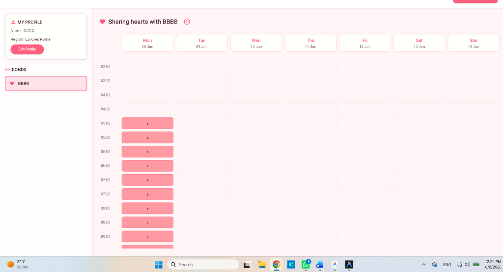
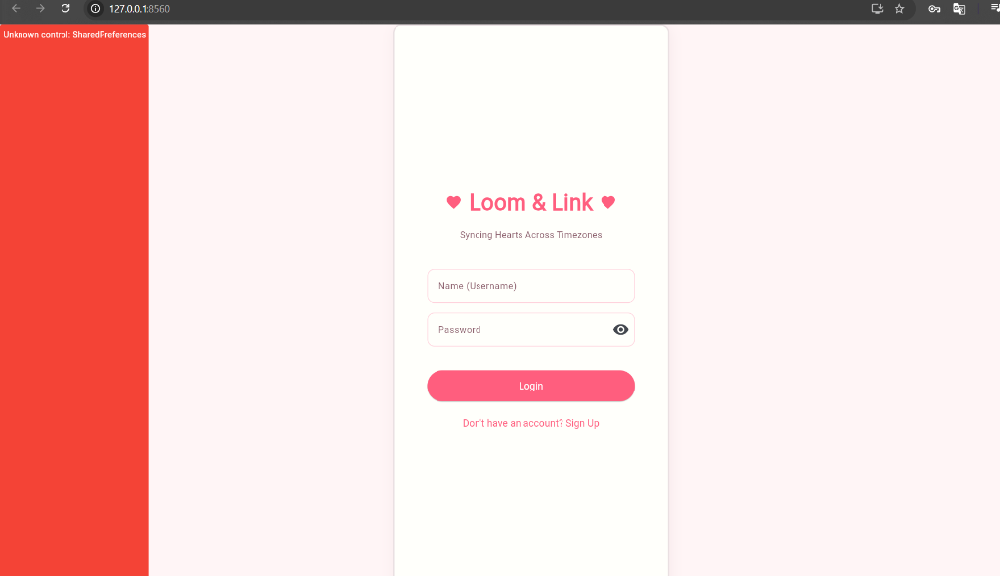
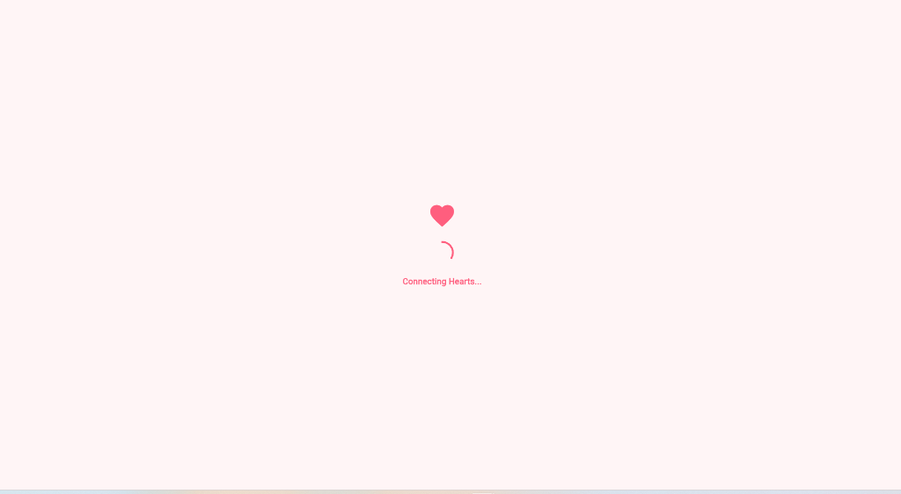
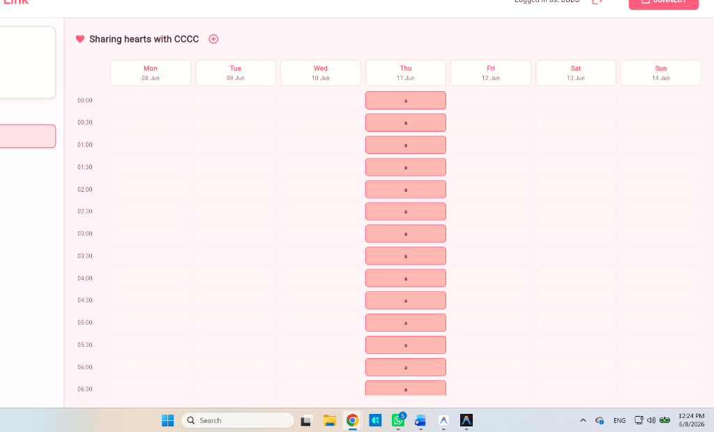

# Loom & Link: LDR Schedule Maker 🌸

Loom & Link is a beautiful, synchronized scheduling web application designed for long-distance couples to align their daily schedules and stay connected across different timezones. 

---

## 📅 May Update (Initial Project State)
*Before June 2026, the application served as an early prototype with the following capabilities and constraints:*

### What Was Workable
- **Basic Concept**: A weekly scheduling layout in Flet with days on the X-axis and 30-minute intervals on the Y-axis.
- **Basic DB Hook**: A connection structure to both SQLite (`loom.db`) and Supabase for cloud hosting.
- **Styling Guide**: A raw 10-color pastel glassmorphism styling setup in `styles.py`.

### Limitations & Critical Bugs
- ❌ **Web Compatibility Failures**: The application could not open or load in web browsers due to obsolete API calls and incompatible storage mechanics (`SharedPreferences` crashed the web interface).
- ❌ **Broken "Add to Schedule" Flow**: The event entry forms failed to save, causing events to completely vanish upon creation.
- ❌ **Disconnected Tables**: Even if users connected, their schedules did not synchronize. Monday and Wednesday events added by one user were invisible on the partner's screen.
- ❌ **Timezone Offset Bugs**: Dates and times were mapped using naive local systems, preventing correct cross-timezone alignment (e.g., a Rome evening event did not align with a New York afternoon slot).

---

## 🛠️ June Update (Engine Overhaul)
*The system was completely refactored to resolve compatibility, synchronization, and layout bugs:*

1. **Robust Timezone & Event Sync Engine**:
   - Switched to strict UTC ISO-strings (`YYYY-MM-DDTHH:MM:SS+00:00`) for all database entries.
   - Automated relative timezone conversion (`pytz`) based on each user's chosen region (e.g., `Europe/Rome`, `Asia/Tokyo`).
   
2. **Fixed Event Grid Mapping & Rendering**:
   - Replaced fragile coordinate-based mapping with dynamic time-interval checks.
   - Weekdays are mapped starting from local Monday midnight, ensuring that day-boundary crossovers (e.g., a late Sunday event in New York showing up on Monday morning in Rome) are automatically handled and placed in the correct grid column.
   
3. **Interactive Pairing Loop**:
   - Added a 5-minute countdown subscription dialog that checks for active pairing codes.
   - Upon connection, the application dynamically re-draws the screen and pairs users in real-time.

4. **Added Kitsune Chibi Companion**:
   - Created `kitsune.py`, a customized vector-style anime mascot that breathes, wags its tail, and celebrates connection success by floating pink hearts (`♥ ◡ ♥`).

---

## 🏆 Finished Project Features
- **Smart Timezone Engine**: Automatically translates and shifts times based on region settings.
- **Glassmorphism Pastel Theme**: Curated soft themes (Strawberry, Mint, Sky Blue, Lavender) matching activity types.
- **Live Syncing**: Real-time partner event streaming via Supabase broadcast channels.
- **Real-time Pairing**: Easily connect using simple shareable 6-digit codes.
- **Detailed Log Tracing**: Full debug tracking for event overlaps and active websocket connections.

---

## 🚀 How to Connect and Synchronize (User Guide)

Follow these steps to synchronize your calendar with your partner:

### 1. Account Setup
1. Open the application (default address: `http://localhost:8560`).
2. Log in or sign up with a unique username and password.
3. Select your local timezone region (e.g., `Europe/Rome` for you, `America/New_York` or `Asia/Tokyo` for your partner).

### 2. Pairing with Your Partner
1. Click **Pair with Partner** in the main dashboard.
2. A unique pairing code will be generated (e.g., `A7X92K`) and a 5-minute countdown will begin.
3. Copy the code and send it to your partner.
4. Your partner simply pastes this code into their **Input Partner Code** field and clicks **Submit**.

5. Once matched, the animated **Kitsune Chibi** mascot will celebrate, and the shared scheduler will open automatically.

### 3. Adding and Synchronizing Events
1. Click the **Add Event** button or click on any empty time slot.
2. Enter the title (e.g., *FaceTime Date*), description, color code, and select the start/end times.
3. Click **Save Event**. 
4. The event will instantly display on both of your screens, adjusted automatically to each viewer's local hour.

---

## 📂 Documentation & Resources
- **LaTeX Source Code**: [`Documentation.txt`](file:///d:/LOOM/Documentation.txt)
- **PDF Version**: [`Tables.pdf`](file:///d:/LOOM/Tables.pdf)
- **Database Schema & Logic**: [`database.py`](file:///d:/LOOM/database.py)
